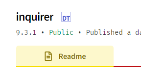

# All Classes Overview till last class.

## Table of Contents

1. [Class01: Setting Up TypeScript](#class01-setting-up-typescript)

- [Course Curriculum](#course-curriculum)
- [TypeScript Course](#typescript-course)
- [TypeScript Setup and Workflow](#typescript-setup-and-workflow)
- [Installation and Verification Guide](#installation-and-verification-guide)
  - [Node.js Installation](#nodejs-installation)
  - [Check Node.js Version](#check-nodejs-version)
  - [VS Code Installation](#vs-code-installation)
  - [Check VS Code Version](#check-vs-code-version)
  - [Changing Terminal from PowerShell to Command Prompt (Cmd) in VS Code](#changing-terminal-from-powershell-to-command-prompt-cmd-in-vs-code)
  - [Installing TypeScript](#installing-typescript)
  - [Verify TypeScript Installation and Version](#verify-typescript-installation-and-version)
  - [Initialization](#initialization)
  - [Compiling TypeScript to JavaScript](#compiling-typescript-to-javascript)
  - [Running the Code](#running-the-code)
  - [Automatic Compilation and Execution](#automatic-compilation-and-execution)
- [Conclusion](#conclusion)

2. [Class02: TypeScript Variables, Operators, and Increment/Decrement](#class02-typescript-variables-operators-and-incrementdecrement)

- [Variables](#variables)
- [Arithmetic Operators](#arithmetic-operators)
- [Increment and Decrement](#increment-and-decrement)
- [Difference Between var, let, and const](#difference-between-var-let-and-const)
- [Importance of Typing](#importance-of-typing)
- [Type Annotations](#type-annotations)
- [Difference Between Pre and Post Increment/Decrement](#difference-between-pre-and-post-incrementdecrement)
- [Overview of Concepts](#overview-of-concepts)

3. [Class 03: Concatenation and Operators and Conditional Statements](#class-03-concatenation-and-operators-and-conditional-statements)

- [String Concatenation](#string-concatenation)

  - [Basic String Concatenation](#basic-string-concatenation)
  - [String with Number Concatenation](#string-with-number-concatenation)

- [Comparison Operators](#comparison-operators)

  - [Equality Operator (`==`)](#equality-operator)
  - [Strict Equality Operator (`===`)](#strict-equality-operator)
  - [Inequality Operator (`!=`)](#inequality-operator)
  - [Strict Inequality Operator (`!==`)](#strict-inequality-operator)
  - [Greater Than Operator (`>`)](#greater-than-operator)
  - [Less Than Operator (`<`)](#less-than-operator)
  - [Greater Than or Equal To Operator (`>=`)](#greater-than-or-equal-to-operator)
  - [Less Than or Equal To Operator (`<=`)](#less-than-or-equal-to-operator)

- [Logical Operators](#logical-operators)

  - [Logical AND (`&&`)](#logical-and)
  - [Logical OR (`||`)](#logical-or)
  - [Logical NOT (`!`)](#logical-not)

- [Conditional Statements](#conditional-statements)

  - [If Statement](#if-statement)
  - [If-Else Statement](#if-else-statement)
  - [If-Else If-Else Statement](#if-else-if-else-statement)

4. [Class 04: Switch Statement and Functions in TypeScript](#class-04-switch-statement-and-functions-in-typescript)

- [Switch Statement](#switch-statement)

  - What is a switch statement
  - Why we use switch instead of if-else
  - Syntax
  - Examples
  - Use cases

- [If-Else vs. Switch](#if-else-vs-switch)

  - When to use if-else
  - When to use switch

- [Function Declaration](#function-declaration)

  - What is a function
  - What is function declaration
  - Syntax
  - Examples

- [Function Parameters](#function-parameters)

  - What are function parameters
  - Syntax
  - Default parameters
  - Examples

- [Function Arguments](#function-arguments)

  - What are arguments
  - How to call function with parameters
  - Differences between parameters and arguments
  - Examples

- [Arrow Functions](#arrow-functions)

  - What is an arrow function
  - Why we use arrow functions instead of simple functions
  - Syntax
  - Benefits
  - Examples

- [Return Keyword](#return-keyword)

  - What is the return keyword
  - Why is it used
  - Usage
  - Examples

- [Recursive Functions](#recursive-functions)
  - What is a recursive function
  - Why is it used
  - Definition
  - Base case
  - Examples

5. [Class 05: JavaScript Functions and Parameters](#class-05-javascript-functions-and-parameters)

- [Function](#function)
- [Return Statement](#return-statement)
- [Parameter Types](#parameter-types)
  - [Default Parameter](#default-parameter)
  - [Optional Parameter](#optional-parameter)
  - [Difference Between Default and Optional Parameters](#difference-between-default-and-optional-parameters)
  - [Why Default/Optional Parameters are Typically Last](#why-defaultoptional-parameters-are-typically-last)
- [Arrow Function](#arrow-function)
- [Spread and Rest Parameters](#spread-and-rest-parameters)
  - [Spread Operator](#spread-operator)
  - [Rest Parameter](#rest-parameter)
- [Naming Conventions](#naming-conventions)
- [Conclusion](#conclusion)

6. [Class 06: Arrays and Loops](#class-06-arrays-and-loops)

- [Arrays](#arrays)
- [Why Use Arrays?](#why-use-arrays)
- [Array Functions](#array-functions)
  - [push](#push)
  - [pop](#pop)
  - [shift](#shift)
  - [unshift](#unshift)
  - [splice](#splice)
  - [indexOf()](#indexof)
  - [lastIndexOf()](#lastindexof)
- [Hoisting](#hoisting)
- [What are Loops?](#loops)
- [While Loops](#while-loops)
- [Why Use Loops?](#why-use-loops)
- [Additional Resources](#additional-resources)

7. [Class 07: Loops and Array Methods](#class-07-loops-and-array-methods)

- [for Loop](#for-loop)
- [do-while Loop](#do-while-loop)
- [Differences Between while Loops and do-while Loops](#difference-between-do-while-loops-and-while-loops)
- [for...in Loop](#for-in-loop)
- [for...of Loop](#for-of-loop)
- [map Method](#map-method)
- [filter Method](#filter-method)
- [forEach Method](#foreach-method)
- [Differences Between map, forEach, and filter](#differences-between-map-foreach-and-filter)
- [Callback Function](#callback-function)
- [Differences Between Array Loops and Other Loops](#differences-between-array-loops-and-other-loops)
- [Function as a Parameter](#function-as-a-parameter)

8. [Class 08: Understanding Objects and Modules in TypeScript](#class-08-understanding-objects-and-modules-in-typescript)

- [What are Objects](#what-are-objects)
- [Why Objects are Needed](#why-objects-are-needed)
- [Where Objects Should be Used](#where-objects-should-be-used)
- [Difference Between Dot and Square Bracket Notation](#difference-between-dot-and-square-bracket-notation)
- [How to Add a Property in an Object](#how-to-add-a-property-in-an-object)
- [How to Get a Property from an Object](#how-to-get-a-property-from-an-object)
- [How to Delete a Property from an Object](#how-to-delete-a-property-from-an-object)
- [How to Update a Property from an Object](#how-to-update-a-property-from-an-object)
- [Nested Objects](#nested-objects)
- [How to Add a Property in a Nested Object](#how-to-add-a-property-in-a-nested-object)
- [How to Get a Property from a Nested Object](#how-to-get-a-property-from-a-nested-object)
- [How to Delete a Property from a Nested Object](#how-to-delete-a-property-from-a-nested-object)
- [How to Update a Property from a Nested Object](#how-to-update-a-property-from-a-nested-object)
- [What are Modules](#what-are-modules)
- [What is Export](#what-is-export)
- [What is Import](#what-is-import)
- [The `as` Keyword in Import](#the-as-keyword-in-import)
- [Difference Between Export and Import](#difference-between-export-and-import)
- [Difference Between Export Default and Named Export](#difference-between-export-default-and-named-export)
- [Difference Between Curly Braces Import and Simple Import](#difference-between-curly-braces-import-and-simple-import)
- [TypeScript Configuration to Use Import/Export](#typescript-configuration-to-use-importexport)

9. [Class 09 - Study Topics](#class-09---study-topics)

- [What is npm](#1-what-is-npm)
- [What is chalk](#2-what-is-chalk)
- [What is Asynchronous Behaviour?](#3-what-is-asynchronous-behaviour)
- [What is Synchronous Behaviour?](#4-what-is-synchronous-behaviour)
- [Difference between Asynchronous and Synchronous Behaviour](#5-difference-between-asynchronous-and-synchronous-behaviour)
- [What are Event Loops](#6-what-are-event-loops)
- [What is setTimeout](#7-what-is-settimeout)
- [What is setInterval](#8-what-is-setinterval)
- [What is clearInterval](#9-what-is-clearinterval)
- [What is IntervalId](#10-what-is-intervalid)
- [What is a Promise](#11-what-is-a-promise)
- [Some Basics of Object-Oriented Programming (OOP)](#12-some-basics-of-object-oriented-programming-oop)
- [Why We Use Object-Oriented Programming (OOP) Instead of Simple Objects](#13-why-we-use-object-oriented-programming-oop-instead-of-simple-objects)
- [What is Inquirer](#14-what-is-inquirer)
- [External Links](#external-links)

10. [Class 10: Introduction to Git and GitHub](#class-10-introduction-to-git-and-github)

- [What is Git?](#what-is-git)
- [Why Use Git?](#why-use-git)
- [What is GitHub?](#what-is-github)
- [Why Use GitHub?](#why-use-github)
- [Benefits of Using Git and GitHub](#benefits-of-using-git-and-github)
- [How to Create an Account on GitHub](#how-to-create-an-account-on-github)
- [How to Create a Repository on GitHub](#how-to-create-a-repository-on-github)
- [Pushing Code Using Command Line](#pushing-code-using-command-line)
  - [Windows](#windows)
  - [Mac/Linux](#maclinux)
- [Git Config Commands](#git-config-commands)
- [Link GitHub with VS Code](#link-github-with-vs-code)
- [Push Code Using VS Code](#push-code-using-vs-code)
- [How to Install GitHub Desktop](#how-to-install-github-desktop)
- [Initializing GitHub Desktop](#initializing-github-desktop)
- [Pushing Code Using GitHub Desktop](#pushing-code-using-github-desktop)
- [Pulling Code Using Command Line](#pulling-code-using-command-line)
  - [Windows](#windows-1)
  - [Mac/Linux](#maclinux-1)
- [Pulling Code Using GitHub Desktop](#pulling-code-using-github-desktop)
- [Cloning a Repository Using Command Line](#cloning-a-repository-using-command-line)
  - [Windows](#windows-2)
  - [Mac/Linux](#maclinux-2)
- [Cloning Repository Using VS Code](#cloning-repository-using-vs-code)
- [Cloning Repository Using GitHub Desktop](#cloning-repository-using-github-desktop)

11. [Online Class: How to Take Input from Inquirer and Revision of Git, GitHub, and Asynchronous Behavior](#online-class-how-to-take-input-from-inquirer-and-revision-of-git-github-and-asynchronous-behavior)

- [Asynchronous Behavior in JavaScript](#asynchronous-behavior-in-javascript)
- [Inquirer](#inquirer)
- [Git and GitHub](#git-and-github)
- [Online Class Link](#online-class-link)
- [Identifying TypeScript Definitions](#identifying-typescript-definitions)

---

# Class01: Setting Up TypeScript

# Course Curriculum

This course covers a diverse range of topics across five quarters:

## Quarter 1: TypeScript

- Introduction to TypeScript
- Basic syntax and data types
- Functions and classes
- Advanced TypeScript features
- Practical applications and projects

## Quarter 2: Next.js (UI/UX)

- Introduction to Next.js framework
- Building user interfaces with Next.js
- Enhancing user experience with Next.js features
- Styling and responsive design
- Real-world projects and case studies

## Quarter 3: Python

- Introduction to Python programming language
- Basic syntax and data structures
- Object-oriented programming in Python
- Python for data analysis and manipulation
- Practical Python applications and projects

## Quarter 4: Generative AI

- Fundamentals of Generative AI
- Generative Adversarial Networks (GANs)
- Variational Autoencoders (VAEs)
- Applications of Generative AI in art, design, and beyond
- Hands-on projects and experimentation with Generative AI models

## Quarter 5: Cloud AI Engineering

- Introduction to Cloud AI services
- Deployment of AI models on cloud platforms
- Scalability and performance optimization techniques
- Cloud-based AI solutions for various domains
- Capstone project involving the integration of AI with cloud technologies

This curriculum offers a comprehensive exploration of key technologies and concepts, providing students with a well-rounded understanding and practical skills in TypeScript, Next.js, Python, Generative AI, and Cloud AI Engineering.

# TypeScript Course

# TypeScript Setup and Workflow

This guide outlines the setup and workflow for working with TypeScript in a project.

# Installation and Verification Guide

## Node.js Installation

- Visit the [Node.js website](https://nodejs.org).
- Click on the LTS version for stability.
- Follow the installation instructions provided for your operating system.

## Check Node.js Version

- Open Command Prompt (Cmd).
- Type `node -v` and press Enter.

## VS Code Installation

- Navigate to the [VS Code website](https://code.visualstudio.com/).
- Download the installer using the provided button.
- Install VS Code by following the installation wizard.

## Check VS Code Version

- Open Command Prompt (Cmd).
- Type `code -v` and press Enter.

## Changing Terminal from PowerShell to Command Prompt (Cmd) in VS Code

### Using Command Palette

#### For Windows Users

1. Open Visual Studio Code.
2. Press `Ctrl + Shift + P` to open the command palette.
3. Type "Terminal: Select Default Profile" and select it from the list.
4. Choose "Command Prompt" or "Command Prompt (Cmd)" from the options provided.
5. Your terminal will switch to Command Prompt as the default.

#### For Mac/Linux Users

1. Open Visual Studio Code.
2. Press `Ctrl + Shift + P` to open the command palette.
3. Type "Terminal: Select Default Profile" and select it from the list.
4. Choose "Command Prompt" or "Command Prompt (Cmd)" from the options provided.
5. Your terminal will switch to Command Prompt as the default.

### Using UI

#### For Windows Users

1. Open Visual Studio Code.
2. Click on the terminal tab at the top menu.
3. Near the top right corner of the terminal, click on the dropdown arrow.
4. Select "Select Default Shell" from the dropdown menu.
5. Choose "Command Prompt" or "Command Prompt (Cmd)" from the list.
6. Your terminal will switch to Command Prompt as the default.

#### For Mac/Linux Users

1. Open Visual Studio Code.
2. Click on the terminal tab at the top menu.
3. Near the top right corner of the terminal, click on the dropdown arrow.
4. Select "Select Default Shell" from the dropdown menu.
5. Choose "Command Prompt" or "Command Prompt (Cmd)" from the list.
6. Your terminal will switch to Command Prompt as the default.

## Installing TypeScript

To install TypeScript, follow these steps:

### For Windows Users

1. Open Command Prompt (Cmd).
2. Type the following command and press Enter:

   - [npm install -g typescript](https://docs.npmjs.com/cli/v7/commands/npm-install)

### For Mac/Linux Users

1. Open Terminal.
2. Type the following command and press Enter:

   - [sudo npm i -g typescript](https://docs.npmjs.com/cli/v7/commands/npm-install)

### What This Command Does

- `npm install -g typescript`: This command installs TypeScript globally on your system, allowing you to use it from any directory.

### Note

- For Mac/Linux users, the `sudo` command is used to execute the installation with administrative privileges.
- Make sure you have Node.js and npm (Node Package Manager) installed on your system before running these commands.

By following these steps, you'll have TypeScript installed and ready to use on your machine.

## Verify TypeScript Installation and Version

- Type `tsc -v` in the command prompt and press Enter.

Make sure you have administrative privileges for installing global packages like TypeScript.

### Versions

- Node.js Version: 20.11.1
- VS Code Version: 1.87.2
- TypeScript Version: 5.4.2

Ensure your system meets the minimum requirements for each software.

## Initialization

1. Run the following command to initialize the TypeScript environment:
   `tsc --init`

2. Create an npm package by running:
   `npm init`

## Compiling TypeScript to JavaScript

To compile TypeScript files into JavaScript:

1. Run the TypeScript compiler with the filename:
   `tsc 'fileName.ts'`

2. This command generates the corresponding JavaScript file.

## Running the Code

To execute the JavaScript code and view the output:

1. Run the following command:
   `node filename.js`

2. This executes the JavaScript file.

## Automatic Compilation and Execution

To avoid manual compilation and execution every time:

1. Use the watch mode in TypeScript compiler to automatically compile the code when changes occur:
   `tsc 'filename.ts' -w`
   or simply
   `tsc -w`

2. Utilize nodemon to automatically run the code when changes occur:
   `nodemon node filename.js`

3. With these commands, changes to the TypeScript files will trigger automatic compilation, and nodemon will restart the script whenever changes are detected.

# Conclusion

Following these steps streamlines the TypeScript development process, allowing for easier compilation and execution of code while minimizing manual intervention.

# Class02: TypeScript Variables, Operators, and Increment/Decrement

## Variables

Variables are crucial elements in programming, variables are placeholders used to store data values. They allow developers to manipulate and work with data within a program. In TypeScript, variables can hold values of different types such as numbers and strings.

### Declaring Variables

Variables in TypeScript are declared using the `var` keyword, followed by the variable name and optionally its type.

- **var**: Variables declared with `var` are function-scoped or globally-scoped. They can be reassigned and updated throughout the program.

```typescript
var numVar: number = 10;
var stringVar: string = "hello world";
```

- **let**: Variables declared with `let` are block-scoped. They can be reassigned within the block they are defined in but cannot be accessed outside of it.

```typescript
let numLet: number = 20;
let stringLet: string = "hello world";
```

- **const**: Variables declared with `const` are also block-scoped and cannot be reassigned once they are initialized. Their value remains constant throughout the program.

```typescript
const numConst: number = 30;
const stringConst: string = "hello world";
```

## Arithmetic Operators

Arithmetic operators perform mathematical calculations on variables and values. They include addition, subtraction, multiplication, division, modulus, and exponentiation.

### Addition

```typescript
let sum: number = 5 + 3; // sum = 8
```

### Subtraction

```typescript
let difference: number = 10 - 3; // difference = 7
```

### Multiplication

```typescript
let product: number = 4 * 2; // product = 8
```

### Division

```typescript
let quotient: number = 10 / 2; // quotient = 5
```

### Modulus (Remainder)

```typescript
let remainder: number = 10 % 3; // remainder = 1
```

### Exponentiation

```typescript
let exponent: number = 2 ** 3; // exponent = 8 (2 raised to the power of 3)
```

## Increment and Decrement

Increment and decrement operators adjust the value of a variable by one.

### Post-increment

```typescript
let x: number = 5;
let postIncrement: number = x++; // postIncrement = 5, x = 6
```

### Pre-increment

```typescript
let y: number = 5;
let preIncrement: number = ++y; // preIncrement = 6, y = 6
```

### Post-decrement

```typescript
let a: number = 5;
let postDecrement: number = a--; // postDecrement = 5, a = 4
```

### Pre-decrement

```typescript
let b: number = 5;
let preDecrement: number = --b; // preDecrement = 4, b = 4
```

## Difference Between var, let, and const

- **var**: Function-scoped or globally-scoped, can be reassigned and updated.
- **let**: Block-scoped, can be reassigned within the block. -**const**: Block-scoped, cannot be reassigned after initialization.

## Difference Between Pre and Post Increment/Decrement

- **Post-increment/decrement**: The value is first used in the expression, and then it is incremented/decremented. That is, the original value is returned, and then the increment/decrement operation occurs.

```typescript
let x: number = 5;
let postIncrement: number = x++; // postIncrement = 5, x = 6
let y: number = 5;
let preDecrement: number = ++y; // preDecrement = 4, y = 5
```

- **Pre-increment/decrement**: The value is first incremented/decremented, and then it is used in the expression. That is, the updated value is returned immediately after the operation.

```typescript
let y: number = 5;
let preIncrement: number = ++y; // preIncrement = 6, y = 6
let x: number = 6;
let preDecrement: number = ++y; // preDecrement = 5, x = 5
```

## Importance of Typing

Typing in TypeScript refers to specifying the data type of variables. It enhances code readability, enables early error detection, and improves code maintainability by providing clarity on the types of data used in the program. By explicitly declaring types, TypeScript helps catch type-related errors during development, reducing bugs and improving overall code quality.

## Type Annotations

Type annotations are a way of explicitly specifying the type of a variable, function parameter, or return value in TypeScript. They are written using a colon followed by the desired type.

```typescript
let num: number = 10; // Type annotation for variable 'num'
function add(x: number, y: number): number {
  // Type annotations for function parameters and return type
  return x + y;
}
```

## Overview of Concepts

- **Variables**: Containers for storing data values. In TypeScript, variables can hold various types of data.
- **Arithmetic Operators**: Symbols for performing mathematical calculations.
- **Increment and Decrement**: Operators to increase or decrease the value of a variable.
- **Post vs. Pre Increment/Decrement**: Post-increment/decrement operators return the current value before modifying it, while pre-increment/decrement operators modify the value first before returning it.
- **Difference Between var, let, and const**: Scoping rules and mutability characteristics of different variable declaration keywords.
- **Difference Between Pre and Post Increment/Decrement**: Timing of the increment/decrement operation in relation to the use of the variable.
- **Importance of Typing**: Enhancing code readability, error detection, and maintainability through explicit type declarations.
- **Type Annotations**: Explicitly specifying the type of variables, function parameters, and return values.

## Conclusion

This TypeScript project provides practical experience with variables, arithmetic operators, and increment/decrement operations.
Understanding the differences between `var`, `let`, and `const` is crucial for writing clean and maintainable code in TypeScript.
Understanding the differences between pre and post increment/decrement operators, as well as the importance of typing and type annotations, is crucial for writing robust and reliable TypeScript code.

Further practice and experimentation will enhance your understanding and proficiency in TypeScript development.

This markdown file serves as the readme.md for the project, documenting its contents and providing guidance for usage and understanding.

## Summary

In this class, we explored fundamental concepts of TypeScript and JavaScript, including string concatenation, comparison operators, logical operators, and conditional statements. These concepts are essential for writing efficient and dynamic code. Understanding how to concatenate strings, compare values, perform logical operations, and execute code conditionally enables developers to create versatile applications capable of handling various scenarios effectively.

Now, let's delve deeper into each topic:

## String Concatenation

This guide provides examples and best practices for concatenating strings in TypeScript.

## Basic String Concatenation

To concatenate strings in TypeScript, you can use the `+` operator or the `concat()` method.

```typescript
const str1: string = "Hello";
const str2: string = "World";

// Using the + operator
const result1: string = str1 + ", " + str2;
console.log(result1); // Output: Hello, World
```

## String with Number Concatenation

When concatenating a string with a number using the `+` operator, TypeScript automatically converts the number to a string.

```typescript
const str: string = "The answer is: ";
const num: number = 42;

const result: string = str + num;

console.log(result); // Output: The answer is: 42
```

However, when using the `+` operator with a number and a string, TypeScript performs addition if both operands are numbers.

```typescript
const num1: number = 10;
const num2: number = 20;
const result: number = num1 + num2;

console.log(result); // Output: 30
```

## String with Multiple Numbers and String Concatenation

To concatenate a string with multiple numbers and strings, you can use the `+` operator or template literals.

```typescript
const str: string = "The values are: ";
const num1: number = 10;
const num2: number = 20;
const word: string = "twenty";

// Using the + operator
const result1: string = str + num1 + ", " + num2 + ", " + word;

// Using template literals
const result2: string = `${str}${num1}, ${num2}, ${word}`;

console.log(result1); // Output: The values are: 10, 20, twenty
console.log(result2); // Output: The values are: 10, 20, twenty
```

# class03: concatenation, operators and conditional Statements

## Comparison Operators

In JavaScript, comparison operators are used to compare two values and return a boolean value (`true` or `false`) based on the comparison result. Here are the comparison operators in JavaScript along with their details:

1. ### Equality Operator (`==`):

   - Checks if two values are equal. It performs type coercion if the operands are of different types.
   - Example: `5 == '5'` returns `true`.

2. ### Strict Equality Operator (`===`):

   - Checks if two values are equal and of the same type. It does not perform type coercion.
   - Example: `5 === '5'` returns `false`.

3. ### Inequality Operator (`!=`):

   - Checks if two values are not equal. It performs type coercion if the operands are of different types.
   - Example: `5 != '5'` returns `false`.

4. ### Strict Inequality Operator (`!==`):

   - Checks if two values are not equal or not of the same type. It does not perform type coercion.
   - Example: `5 !== '5'` returns `true`.

5. ### Greater Than Operator (`>`):

   - Checks if the left operand is greater than the right operand.
   - Example: `5 > 3` returns `true`.

6. ### Less Than Operator (`<`):

   - Checks if the left operand is less than the right operand.
   - Example: `3 < 5` returns `true`.

7. ### Greater Than or Equal To Operator (`>=`):

   - Checks if the left operand is greater than or equal to the right operand.
   - Example: `5 >= 5` returns `true`.

8. ### Less Than or Equal To Operator (`<=`):

   - Checks if the left operand is less than or equal to the right operand.
   - Example: `3 <= 5` returns `true`.

These comparison operators are extensively used in conditional statements, loops, and other control flow constructs in JavaScript.

## Logical Operators

In JavaScript, logical operators are used to perform logical operations on Boolean values. Here are the logical operators along with their details:

1. ### Logical AND (`&&`):

   - Returns `true` if both operands are `true`, otherwise returns `false`.
   - Example: `true && true` returns `true`, `true && false` returns `false`.

2. ### Logical OR (`||`):

   - Returns `true` if at least one of the operands is `true`, otherwise returns `false`.
   - Example: `true || false` returns `true`, `false || false` returns `false`.

3. ### Logical NOT (`!`):
   - Returns the opposite of the operand's Boolean value. If the operand is `true`, `!` returns `false`; if the operand is `false`, `!` returns `true`.
   - Example: `!true` returns `false`, `!false` returns `true`.

These logical operators are often used to construct complex conditions in control flow statements, such as `if` statements and loops, or to perform conditional operations. They can also be used with non-Boolean values, where JavaScript performs type coercion to interpret values as Boolean.

## Conditional Statements

Conditional statements in JavaScript are used to execute different code blocks based on certain conditions. The main types of conditional statements in JavaScript are:

1.  ### If Statement:

    - The `if` statement executes a block of code if a specified condition is true.

    ```javascript
    if (condition) {
      // code to be executed if condition is true
    }
    ```

2.  ### If-Else Statement:

    - The `if-else` statement executes one block of code if a specified condition is true and another block of code if the condition is false.

    ```javascript
    if (condition) {
      // code to be executed if condition is true
    } else {
      // code to be executed if condition is false
    }
    ```

3.  ### If-Else-If-Else Statement:

    - The `if-else-if` statement allows you to check multiple conditions and execute different code blocks based on which condition evaluates to true first.

    ```javascript
    if (condition1) {
      // code to be executed if condition1 is true
    } else if (condition2) {
      // code to be executed if condition2 is true
    } else {
      // code to be executed if neither condition1 nor condition2 is true
    }
    ```

Conditional statements are fundamental in programming as they enable the execution of specific code blocks based on different conditions, allowing for more flexible and dynamic behavior in your programs.

## Conclusion

Understanding string concatenation, comparison operators, logical operators, and conditional statements are fundamental skills in TypeScript and JavaScript programming. By mastering these concepts, you can write more efficient and powerful code, create dynamic applications, and make informed decisions based on various conditions and data.

# Class 04: Switch Statement and Functions in TypeScript

## Summary

This class covers essential concepts in TypeScript and JavaScript programming, including switch statements for multi-case branching, function declarations for defining reusable code blocks, function parameters and arguments for passing data to functions, arrow functions for concise syntax and lexical scoping, the return keyword for exiting functions and returning values, and recursive functions for solving problems through self-referential algorithms.

By mastering these concepts, you will gain a deeper understanding of programming fundamentals and be better equipped to write efficient and maintainable code.

Now, let's delve deeper into each topic:

## Switch Statement

A switch statement is a control flow statement that allows a program to evaluate an expression and execute code blocks based on matching cases.

### What is a switch statement

A switch statement evaluates an expression and matches its value to a case label. It then executes the associated block of code.

### Why we use switch instead of if-else

Switch statements are used instead of if-else when there are multiple conditions based on a single value. Switch can be more readable and concise in such cases.

### Syntax:

```typescript
switch (expression) {
  case value1:
    // code block 1
    break;
  case value2:
    // code block 2
    break;
  default:
  // default code block
}
```

### Examples:

```typescript
let day: number = 3;
let dayName: string;

switch (day) {
  case 1:
    dayName = "Monday";
    break;
  case 2:
    dayName = "Tuesday";
    break;
  case 3:
    dayName = "Wednesday";
    break;
  default:
    dayName = "Invalid day";
}
console.log(dayName); // Output: Wednesday
```

### Use Cases:

- Handling multiple conditions with different outcomes.
- Improving readability and maintainability of code.

## If-Else vs. Switch

Both if-else and switch statements are used for decision making, but they are suited to different scenarios.

### When to use if-else:

- When there are only a few conditions to check.
- When conditions are complex and not easily represented by a switch statement.
- When conditions involve non-constant expressions.

### When to use switch:

- When there are multiple possible conditions to evaluate against a single value.
- When conditions are simple and can be represented by constant expressions.
- When the code needs to be more readable and concise.

## Function Declaration

A function declaration defines a named function that can be reused throughout the code.

### What is a function

A function is a block of code designed to perform a particular task. It is executed when it is called or invoked.

### What is function declaration

A function declaration is a way to define a function with a specific name and body of code.

### Syntax:

```typescript
function functionName(parameters) {
  // code block
}
```

### Examples:

```typescript
function greet(name: string): void {
  console.log(`Hello, ${name}!`);
}

greet("John"); // Output: Hello, John!
```

## Function Parameters

Function parameters are placeholders for values that are passed to a function when it is called.

### What are function parameters

Parameters are variables listed as a part of the function definition. They receive values (arguments) when the function is called.

### Syntax:

```typescript
function functionName(param1: type, param2: type) {
  // code block
}
```

### Default parameters:

```typescript
function greet(name: string = "World"): void {
  console.log(`Hello, ${name}!`);
}

greet(); // Output: Hello, World!
```

### Examples:

```typescript
function add(a: number, b: number): number {
  return a + b;
}

console.log(add(3, 5)); // Output: 8
```

## Function Arguments

Function arguments are the actual values passed to a function when it is called.

### What are arguments

Arguments are the actual values supplied to the function parameters when the function is invoked.

### How to call a function with parameters

You call a function with parameters by providing the arguments in the parentheses of the function call.

### Differences between parameters and arguments

- Parameters are defined in the function declaration.
- Arguments are provided when calling the function.

### Examples:

```typescript
function add(a: number, b: number): number {
  return a + b;
}

console.log(add(3, 5)); // Output: 8
```

## Arrow Functions

Arrow functions provide a concise syntax for writing functions in JavaScript.

### What is an arrow function

An arrow function is a shorter syntax for writing function expressions. It uses the `=>` syntax.

### Why we use arrow functions instead of simple functions

Arrow functions offer shorter syntax and have lexical scoping of the `this` keyword, making them useful for callbacks and methods where the context needs to be preserved.

### Syntax:

```typescript
const functionName = (parameters) => {
  // code block
};
```

### Benefits:

- Shorter syntax.
- Lexical scoping (preserving the context of `this`).

### Examples:

```typescript
const greet = (name: string): void => {
  console.log(`Hello, ${name}!`);
};

greet("Jane"); // Output: Hello, Jane!
```

## Return Keyword

The return keyword is used to exit a function and return a value to its caller.

### What is the return keyword

The `return` keyword terminates the execution of a function and specifies a value to be returned to the function caller.

### Why is it used

The `return` keyword is used to send a value back to the caller and to exit a function.

### Usage:

- To return a value from a function.
- To exit a function prematurely.

### Examples:

```typescript
function add(a: number, b: number): number {
  return a + b;
}

console.log(add(3, 5)); // Output: 8
```

## Recursive Functions

A recursive function is a function that calls itself until a base condition is met.

### What is a recursive function

A recursive function solves problems by breaking them down into smaller, similar sub-problems and calling itself.

### Why is it used

Recursive functions are used to solve problems that can be divided into smaller, similar problems. They are often used in algorithms such as sorting and searching.

### Definition:

- Recursive functions solve problems by breaking them down into smaller, similar sub-problems.

### Base case:

- A base case is a condition that stops the recursion.

### Examples:

```typescript
function factorial(n: number): number {
  if (n === 0 || n === 1) {
    return 1;
  } else {
    return n * factorial(n - 1);
  }
}

console.log(factorial(5)); // Output: 120
```

By understanding and practicing these concepts, you will be better prepared to write efficient and effective TypeScript and JavaScript code.

# Class 05: JavaScript Functions and Parameters

## Function

Functions in JavaScript are blocks of code designed to perform a particular task. They can be defined using the `function` keyword followed by a name, parameters (optional), and a block of code.

```javascript
function functionName(parameter1, parameter2) {
  // Function body
}
```

## Return Statement

The `return` statement is used within a function to specify the value that the function should return when called.

```javascript
function add(a, b) {
  return a + b;
}
```

## Parameter Types

### Default Parameter

Default parameters allow you to initialize a function's parameters with default values if no value or `undefined` is passed.

```javascript
function greet(name = "Guest") {
  console.log(`Hello, ${name}!`);
}
```

### Optional Parameter

Optional parameters allow you to define parameters that are not required when calling a function.

```javascript
function greet(name) {
  if (name) {
    console.log(`Hello, ${name}!`);
  } else {
    console.log("Hello!");
  }
}
```

### Difference Between Default and Optional Parameters

Default parameters are initialized with a value if no argument is provided, whereas optional parameters can be omitted entirely when calling the function.

### Why Default/Optional Parameters are Typically Last

In JavaScript, default and optional parameters should generally come last in the parameter list to avoid confusion and ensure clarity when invoking functions with fewer arguments than defined parameters.

## Arrow Function

Arrow functions provide a more concise syntax compared to traditional function expressions.

```javascript
const add = (a, b) => {
  return a + b;
};
```

## Spread and Rest Parameters

### Spread Operator

The spread operator (`...`) allows an iterable such as an array expression or string to be expanded in places where zero or more arguments (for function calls) or elements (for array literals) are expected.

```javascript
const numbers = [1, 2, 3];
console.log(...numbers); // Output: 1 2 3
```

### Rest Parameter

The rest parameter syntax (`...name`) allows us to represent an indefinite number of arguments as an array.

```javascript
function sum(...numbers) {
  return numbers.reduce((acc, num) => acc + num, 0);
}
console.log(sum(1, 2, 3)); // Output: 6
```

## Naming Conventions

Naming conventions ensure consistency and readability across codebases. Here are commonly used conventions:

- **camelCase**: e.g., `camelCaseExample`
- **PascalCase**: e.g., `PascalCaseExample`
- **snake_case**: e.g., `snake_case_example`
- **ALL_CAPS**: e.g., `MAX_VALUE`

These conventions are widely used in different programming languages:

- **JavaScript and Java**: camelCase, PascalCase
- **Python**: snake_case
- **C/C++**: ALL_CAPS

## Conclusion

Understanding functions and parameters in JavaScript is crucial for developing efficient and maintainable code. By mastering these concepts, you can enhance code organization, promote reusability, and ensure clarity in your projects.

# Class 06: Arrays and Loops

In this class we study arrays and loops

## Arrays

Arrays are a fundamental data structure in programming that allow you to store multiple values under a single variable name. Unlike simple variables that hold only one value at a time, arrays can contain multiple values, making them suitable for scenarios where you need to work with collections of data. For example, you can use an array to store a list of names, numbers, or any other type of data.

### Syntax:

```typescript
// Declaring an array
let numbers: number[] = [1, 2, 3, 4, 5];

// Accessing elements of an array
console.log(numbers[0]); // Output: 1
```

## Why Use Arrays?

Arrays offer several advantages over simple variables:

- **Grouping Data**: Arrays allow you to group related data together under one variable, making it easier to manage and manipulate large sets of data.
- **Iterating Over Elements**: With arrays, you can easily iterate over each element using loops, making it convenient to perform operations on each item in the collection.
- **Dynamic Size**: Arrays in most programming languages can dynamically grow or shrink in size, allowing you to add or remove elements as needed.
- **Efficient Access**: Arrays provide fast and efficient access to individual elements using their index, which represents their position in the array.

## Array Functions

Array functions are built-in methods that allow you to manipulate arrays in various ways. Here are some commonly used array functions:

### push

The `push` method adds one or more elements to the end of an array.

### Syntax:

```typescript
let fruits: string[] = ["apple", "banana", "orange"];
fruits.push("mango");
console.log(fruits); // Output: ['apple', 'banana', 'orange', 'mango']
```

### pop

The `pop` method removes the last element from an array and returns that element.

### Syntax:

```typescript
let fruits: string[] = ["apple", "banana", "orange"];
let removedFruit: string = fruits.pop();
console.log(removedFruit); // Output: orange
console.log(fruits); // Output: ['apple', 'banana']
```

### shift

The `shift` method removes the first element from an array and returns that element, shifting all subsequent elements to a lower index.

### Syntax:

```typescript
let fruits: string[] = ["apple", "banana", "orange"];
let removedFruit: string = fruits.shift();
console.log(removedFruit); // Output: apple
console.log(fruits); // Output: ['banana', 'orange']
```

### unshift

The `unshift` method adds one or more elements to the beginning of an array.

### Syntax:

```typescript
let fruits: string[] = ["banana", "orange"];
fruits.unshift("apple");
console.log(fruits); // Output: ['apple', 'banana', 'orange']
```

### splice

The `splice` method adds or removes elements from any position in an array.

### Syntax:

```typescript
let fruits: string[] = ["apple", "orange", "mango"];
// Removing 1 element from index 1
fruits.splice(1, 1);
console.log(fruits); // Output: ['apple', 'mango']
// Adding 'banana' and 'grape' at index 1
fruits.splice(1, 0, "banana", "grape");
console.log(fruits); // Output: ['apple', 'banana', 'grape', 'mango']
```

### indexOf()

The `indexOf()` method returns the index of the first occurrence of a specified value in an array.

### Syntax:

```typescript
let fruits: string[] = ["apple", "banana", "orange", "banana"];
console.log(fruits.indexOf("banana")); // Output: 1
```

### lastIndexOf()

The `lastIndexOf()` method returns the index of the last occurrence of a specified value in an array.

### Syntax:

```typescript
let fruits: string[] = ["apple", "banana", "orange", "banana"];
console.log(fruits.lastIndexOf("banana")); // Output: 3
```

## Hoisting

### What is Hoisting?

Hoisting is a JavaScript mechanism where variables and function declarations are moved to the top of their containing scope during the compilation phase. This means that regardless of where variables and functions are declared, they are moved to the top of their scope.

### Hoisting in Variables and Functions

Variables declared with `var` are hoisted and initialized with `undefined` while functions declared with `function` are fully hoisted (both the declaration and the function definition).

# Loops

Loops are control flow statements used to repeatedly execute a block of code as long as a specified condition is true. They are essential for automating repetitive tasks and iterating over data collections.

## While Loops

While loops are a control flow statement used to execute a block of code repeatedly as long as a specified condition is true. They are useful when you need to perform a task multiple times without knowing the exact number of iterations beforehand.

### Syntax:

```typescript
let count: number = 0;
while (count < 5) {
  console.log(count);
  count++;
}
```

## Why Use Loops?

Loops are essential in programming for several reasons:

- **Repetition**: Loops allow you to execute a block of code multiple times, reducing the need for redundant code.
- **Automation**: Loops automate repetitive tasks, such as iterating over arrays or processing large sets of data.
- **Dynamic Control**: Loops provide dynamic control flow based on changing conditions, allowing your program to adapt to different scenarios.

Understanding arrays and loops is fundamental in programming as they enable you to efficiently work with collections of data and automate repetitive tasks, making your code more versatile and scalable.

Feel free to explore the TypeScript code provided in this repository to understand how these concepts are implemented. You can run the code using a TypeScript compiler or an online TypeScript playground.

## Additional Resources:

- [MDN Web Docs: Arrays](https://developer.mozilla.org/en-US/docs/Web/JavaScript/Reference/Global_Objects/Array)
- [MDN Web Docs: while statement](https://developer.mozilla.org/en-US/docs/Web/JavaScript/Reference/Statements/while)
- [MDN Web Docs: Hoisting](https://developer.mozilla.org/en-US/docs/Glossary/Hoisting)

Happy coding!

# Class 07: Loops and Array Methods

In this class, we will cover different types of loops in TypeScript and how to manipulate arrays using built-in methods.

## `for` Loop

The `for` loop is one of the most commonly used loops in TypeScript. It repeats a block of code a specified number of times.

### Syntax

```typescript
for (initialization; condition; increment) {
  // code block to be executed
}
```

### Example

```typescript
for (let i = 0; i < 5; i++) {
  console.log(i);
}
// Output: 0, 1, 2, 3, 4
```

The `for` loop is useful when you know the exact number of iterations needed. It consists of three parts: initialization, condition, and increment.

## `do-while` Loop

The `do-while` loop is similar to the `while` loop, but it guarantees that the loop body will be executed at least once.

### Syntax

```typescript
do {
  // code block to be executed
} while (condition);
```

### Example

```typescript
let i = 0;
do {
  console.log(i);
  i++;
} while (i < 5);
// Output: 0, 1, 2, 3, 4
```

The `do-while` loop is useful when you want to ensure that the loop body executes at least once before the condition is checked.

## Difference between `do-while` loops and `while` loops

### `while` Loop

- **Syntax**: The `while` loop executes a block of code as long as the specified condition evaluates to `true`.
- **Execution**: The condition is evaluated before executing the loop body. If the condition is `false` initially, the loop body is never executed.
- **Example**:
  ```typescript
  let i = 0;
  while (i < 5) {
    console.log(i);
    i++;
  }
  // Output: 0, 1, 2, 3, 4
  ```
- **Usage**: `while` loops are useful when you want to execute a block of code repeatedly based on a condition that may change during execution.

### `do-while` Loop

- **Syntax**: The `do-while` loop executes a block of code once before checking if the condition is `true`, then it will repeat the loop as long as the condition evaluates to `true`.
- **Execution**: The loop body is executed at least once, regardless of whether the condition is `true` or `false`.
- **Example**:
  ```typescript
  let i = 0;
  do {
    console.log(i);
    i++;
  } while (i < 5);
  // Output: 0, 1, 2, 3, 4
  ```
- **Usage**: `do-while` loops are useful when you want to ensure that the loop body is executed at least once, regardless of the condition.

### Key Differences

1. **Execution Guarantee**: In a `while` loop, the loop body may never execute if the initial condition is `false`. In a `do-while` loop, the loop body always executes at least once.
2. **Condition Check**: In a `while` loop, the condition is checked before the loop body executes. In a `do-while` loop, the condition is checked after the loop body executes.
3. **Initialization**: Typically, the loop variable is initialized before entering a `while` loop, while it is often initialized after entering a `do-while` loop.

Sure, let's continue from the `for...in` loop and cover the remaining topics:

---

## `for...in` Loop

The `for...in` loop iterates over all enumerable properties of an object. In TypeScript, it's commonly used to iterate over object keys.

### Syntax

```typescript
for (variable in object) {
  // code block to be executed
}
```

### Example

```typescript
const person = { name: "John", age: 30 };

for (let key in person) {
  console.log(`${key}: ${person[key]}`);
}
// Output: name: John, age: 30
```

The `for...in` loop is useful when you need to iterate over the properties of an object, such as when working with key-value pairs.

## `for...of` Loop

The `for...of` loop iterates over iterable objects (arrays, strings, etc.) and is preferred over `for...in` for arrays in TypeScript.

### Syntax

```typescript
for (variable of iterable) {
  // code block to be executed
}
```

### Example

```typescript
const colors = ["red", "green", "blue"];

for (let color of colors) {
  console.log(color);
}
// Output: red, green, blue
```

The `for...of` loop simplifies iteration over arrays and other iterable objects by directly accessing their values, rather than indices or keys.

## Differences Between `for...in` and `for...of` Loops

### `for...in` Loop

- **Purpose**: Iterates over enumerable properties of an object.
- **Usage**: Commonly used to iterate over object keys or properties.
- **Example**:

  ```typescript
  const person = { name: "John", age: 30 };

  for (let key in person) {
    console.log(`${key}: ${person[key]}`);
  }
  // Output: name: John, age: 30
  ```

### `for...of` Loop

- **Purpose**: Iterates over iterable objects like arrays, strings, etc.
- **Usage**: Preferred for iterating over values of iterable objects.
- **Example**:

  ```typescript
  const colors = ["red", "green", "blue"];

  for (let color of colors) {
    console.log(color);
  }
  // Output: red, green, blue
  ```

### Key Differences

- **Iterable Type**: `for...in` loops over object properties, while `for...of` loops over iterable values.
- **Output**: `for...in` provides keys or properties, whereas `for...of` provides values directly.
- **Compatibility**: `for...of` is not compatible with objects directly and is used mainly with arrays and other iterables.

## Callback Function

A callback function is a function that is passed as an argument to another function, with the intention of being executed later. In the context of array methods like `map`, `forEach`, and `filter`, the callback function is applied to each element of the array.

For example, in the `map` method:

```typescript
const numbers: number[] = [1, 2, 3, 4, 5];
const squared: number[] = numbers.map((number) => number * number);
```

The arrow function `(number) => number * number` is a callback function. It defines the operation to be performed on each element of the `numbers` array.

## Differences Between Array Loops and Other Loops

### Traditional Loops (`for`, `do-while`)

Traditional loops like `for` and `do-while` are more flexible and can be used for a variety of tasks beyond just iterating over arrays. They require manual index management and can directly mutate variables outside the loop scope.

### Array Methods (`map`, `filter`, `forEach`)

Array methods like `map`, `filter`, and `forEach` provide a more functional approach to working with arrays. They promote immutability by returning new arrays without modifying the original. These methods align with functional programming paradigms, making code more predictable and easier to test.

### Example Comparison

#### Using `for` Loop

```typescript
const numbers = [1, 2, 3, 4, 5];
const squared = [];
for (let i = 0; i < numbers.length; i++) {
  squared.push(numbers[i] * numbers[i]);
}
console.log(squared);
// Output: [1, 4, 9, 16, 25]
```

#### Using `map`

```typescript
const numbers = [1, 2, 3, 4, 5];
const squared = numbers.map((number) => number * number);
console.log(squared);
// Output: [1, 4, 9, 16, 25]
```

## Function as a Parameter

In TypeScript, you can pass functions as parameters to other functions. This allows for greater flexibility and code reusability.

### Example

```typescript
// Define a function type for functions that take a number and return a number
type UnaryFunction = (x: number) => number;

// Function that takes another function as a parameter
const applyFunction = (func: UnaryFunction, value: number): number => {
  return func(value);
};

// Using an inline arrow function to square a number
const square: UnaryFunction = (x: number): number => x * x;

// Using the applyFunction with square function
const squareResult = applyFunction(square, 5);
console.log(squareResult); // Output: 25
```

In this example, the `applyFunction` function takes another function (`func`) and a value as parameters. It then applies the given function to the value and returns the result.

# Class 08: Understanding Objects and Modules in TypeScript

Welcome to Class 08 of TypeScript where we explore fundamental concepts related to objects and modules. Below, you'll find detailed explanations and examples covering various aspects of TypeScript objects and modules.

## What are Objects

Objects in TypeScript are fundamental data structures that allow us to encapsulate related data and functionality into a single unit. They consist of properties (data) and methods (functions) which operate on that data.

### Why Objects are Needed

Objects are essential in TypeScript for several reasons:

- **Organize Data:** Group related information together for better structure and readability.
- **Modularity:** Encapsulate reusable code blocks, promoting code reuse and maintainability.
- **Encapsulation:** Protect and manage the state of an application, controlling access to properties and methods.
- **Inheritance:** Facilitate code reuse through inheritance, sharing properties and methods between objects.

### Where Objects Should be Used

Objects are suitable for various scenarios:

- **Modeling Real-World Entities:** Represent entities like users, products, or cars with their respective properties (e.g., name, age, model).
- **Storing and Manipulating Data:** Manage structured data such as configurations, user profiles, or any complex data structure.
- **Encapsulating Functionality:** Group related methods and properties, ensuring cohesive and organized codebases.
- **Working with JSON Data:** Easily map JSON data to TypeScript objects for manipulation and data transformation.

### Difference Between Dot and Square Bracket Notation

- **Dot Notation:**

  - Directly accesses object properties using the property name.
  - Cannot use dynamic property names or names containing special characters.

  Example:

```typescript
let obj = { name: "Alice" };
console.log(obj.name); // Output: Alice
```

- **Square Bracket Notation:**

  - Accesses object properties dynamically using a string or variable containing the property name.
  - Useful for dynamic property access or names with special characters.

  Example:

```typescript
let obj = { name: "Alice" };
let propertyName = "name";
console.log(obj[propertyName]); // Output: Alice
```

## How to Add a Property in an Object

### Using Dot Notation

To add a property using dot notation:

```typescript
let obj: { [key: string]: any } = {};
obj.newProperty = "value";
```

### Using Bracket Notation

To add a property using bracket notation:

```typescript
let obj: { [key: string]: any } = {};
obj["newProperty"] = "value";
```

## How to Get a Property from an Object

### Using Dot Notation

To get a property using dot notation:

```typescript
let value = obj.propertyName;
```

### Using Bracket Notation

To get a property using bracket notation:

```typescript
let value = obj["propertyName"];
```

## How to Delete a Property from an Object

### Using Dot Notation

To delete a property using dot notation:

```typescript
delete obj.propertyName;
```

Certainly! Let's continue from where we left off:

### How to Delete a Property from an Object

#### Using Dot Notation

To delete a property from an object using dot notation:

```typescript
delete obj.propertyName;
```

#### Using Bracket Notation

To delete a property from an object using bracket notation:

```typescript
delete obj["propertyName"];
```

### How to Update a Property from an Object

#### Using Dot Notation

To update a property in an object using dot notation:

```typescript
obj.propertyName = newValue;
```

#### Using Bracket Notation

To update a property in an object using bracket notation:

```typescript
obj["propertyName"] = newValue;
```

### Nested Objects

Nested objects are objects that are properties of other objects, enabling the creation of complex data structures.

### How to Add a Property in a Nested Object

#### Using Dot Notation

To add a property in a nested object using dot notation:

```typescript
nestedObj.outerProperty.newInnerProperty = "newValue";
```

#### Using Bracket Notation

To add a property in a nested object using bracket notation:

```typescript
nestedObj["outerProperty"]["newInnerProperty"] = "newValue";
```

### How to Get a Property from a Nested Object

#### Using Dot Notation

To get a property from a nested object using dot notation:

```typescript
let value = nestedObj.outerProperty.innerProperty;
```

#### Using Bracket Notation

To get a property from a nested object using bracket notation:

```typescript
let value = nestedObj["outerProperty"]["innerProperty"];
```

### How to Delete a Property from a Nested Object

#### Using Dot Notation

To delete a property from a nested object using dot notation:

```typescript
delete nestedObj.outerProperty.innerProperty;
```

#### Using Bracket Notation

To delete a property from a nested object using bracket notation:

```typescript
delete nestedObj["outerProperty"]["innerProperty"];
```

### How to Update a Property from a Nested Object

#### Using Dot Notation

To update a property in a nested object using dot notation:

```typescript
nestedObj.outerProperty.innerProperty = newValue;
```

#### Using Bracket Notation

To update a property in a nested object using bracket notation:

```typescript
nestedObj["outerProperty"]["innerProperty"] = newValue;
```

Certainly! Let's continue from the topic of modules:

## What are Modules

Modules in TypeScript are essential for organizing code into reusable, independent units. They help in managing dependencies and promoting encapsulation. Modules allow you to define private and public parts of your code, enhancing maintainability and readability.

### Key Features of Modules:

- **Encapsulation:** Modules encapsulate code, making it easier to manage and reducing namespace pollution.
- **Reusability:** Code defined in modules can be reused across different parts of an application or even in different projects.
- **Dependency Management:** Modules define explicit dependencies, making it clear which parts of the code rely on other parts.
- **Scope Control:** Modules provide scope isolation, allowing you to define private and public members that are accessible only within the module or externally as needed.

## What is Export

Exporting in TypeScript allows you to make functions, variables, classes, or even types available for use in other modules. It essentially exposes the defined entities from the module so that they can be imported and used in other parts of the application.

### Example of Exporting:

```typescript
// module.ts
export const myVariable = "value";

export function myFunction() {
  // function code
}

export class MyClass {
  // class code
}
```

In this example:

- `myVariable`, `myFunction`, and `MyClass` are exported from `module.ts`.
- They can be imported into other modules using TypeScript's import syntax.

## What is Import

Importing in TypeScript allows you to bring functionalities (variables, functions, classes, etc.) from other modules into the current module. This makes it possible to use those functionalities as if they were defined locally within the importing module.

### Example of Importing:

```typescript
// main.ts
import { myVariable, myFunction, MyClass } from "./module";

// Now you can use myVariable, myFunction, and MyClass here
```

In this example:

- `myVariable`, `myFunction`, and `MyClass` are imported from the `module.ts` module.
- They can be used in `main.ts` as if they were defined within `main.ts`.

## The `as` Keyword in Import

The `as` keyword in TypeScript import statements allows you to rename imported bindings to different names. This can be useful for improving code readability or avoiding naming conflicts when importing multiple entities from different modules.

### Example of Using `as` Keyword:

```typescript
import { myFunction as renamedFunction } from "./module";

// Now you can use renamedFunction instead of myFunction
```

In this example:

- `myFunction` from `module.ts` is imported and renamed as `renamedFunction`.
- You can now use `renamedFunction` in your code instead of `myFunction`.

## Difference Between Export and Import

- **Export:** Makes functionalities (variables, functions, classes) available for use in other modules by exposing them.
- **Import:** Brings functionalities from other modules into the current module for use within that module.

## Difference Between Export Default and Named Export

- **Export Default:** Used to export a single value (function, class, object, etc.) as the default export of a module. There can only be one default export per module.

  Example:

  ```typescript
  // module.ts
  export default function myDefaultFunction() {
    // function code
  }
  ```

- **Named Export:** Used to export multiple values (variables, functions, classes, etc.) from a module by explicitly naming each export.

  Example:

  ```typescript
  // module.ts
  export const myVariable = "value";

  export function myFunction() {
    // function code
  }
  ```

## Difference Between Curly Braces Import and Simple Import

- **Curly Braces Import:** Used for importing named exports from a module. You specify the exact names of the exports you want to import within curly braces `{}`.

  Example:

  ```typescript
  // main.ts
  import { myVariable, myFunction } from "./module";
  ```

- **Simple Import:** Used for importing the default export from a module. There is no need for curly braces when importing the default export.

  Example:

  ```typescript
  // main.ts
  import myDefaultFunction from "./module";
  ```

# TypeScript Configuration to Use Import/Export

To properly work with modules in TypeScript, certain changes are required in the `package.json` and `tsconfig.json` files.

## Updating Configuration Files

If you need to update the configuration files `tsconfig.json` and `package.json` for your TypeScript project, you can follow these steps:

## Updating tsconfig.json

1. **Change Target to ES2022:**
   Update the `target` option in `tsconfig.json` to specify ES2022 as the target ECMAScript version.

   Example:

   ```json
   {
     "compilerOptions": {
       "target": "ES2022", ///at line 14
       ...
     },
    ...
   }
   ```

1. **Change Module to NodeNext:**
   Change the module option to specify NextNode as the module system.

Example:

```json
{
  "compilerOptions": {
    ...
    "module": "NodeNext", // at line 28
    ...
  },
  ...
}
```

2. **Update Module Resolution:**
   Comment out the moduleResolution option and change its value to NodeNext.

Example:

```json
{
  "compilerOptions": {
    ...
    // "moduleResolution": "Node",  // Commented out
    "moduleResolution": "NodeNext", // at line 30
    ...
  },
  ...
}
```

## Updating package.json

1. **Add Type Module:**
   After the "main" field in package.json, add a "type" field with the value "module" to indicate that your project uses ECMAScript modules.

Example:

```json
{
  "name": "your-package-name",
  "version": "1.0.0",
  "description": "Your package description",
  "main": "index.js",
  "type": "module",  // Added line
  "scripts": {
    ...
  },
  ...
}
```

# Class 09 - Study Topics

Welcome to class09 repository

## Topics Covered in Today's Class

### 1. What is npm

**npm (Node Package Manager)** is a package manager for JavaScript, widely used for managing dependencies in Node.js projects. It allows developers to install, share, and manage libraries and tools.

For more details, visit the [npm documentation](https://docs.npmjs.com/).

### 2. What is chalk

**Chalk** is a library used for styling console output in Node.js. It allows developers to easily add colors and styles to their terminal strings.

**Installation:**

```sh
npm install chalk
```

**Usage:**

```javascript
const chalk = require("chalk");
console.log(chalk.blue("Hello, world!"));
```

For more details, visit the [Chalk documentation](https://www.npmjs.com/package/chalk?activeTab=readme).

### 3. What is Asynchronous Behaviour?

**Asynchronous behaviour** refers to the execution of operations independently of the main program flow, allowing the program to continue running while waiting for the operation to complete.

### 4. What is Synchronous Behaviour?

**Synchronous behaviour** refers to the execution of operations sequentially, where each operation waits for the previous one to complete before starting.

### 5. Difference between Asynchronous and Synchronous Behaviour

- **Asynchronous**: Operations run independently of the main program flow, enhancing performance and responsiveness.
- **Synchronous**: Operations run sequentially, often causing the program to wait and potentially reducing performance.

### 6. What are Event Loops

**Event loops** are mechanisms that manage the execution of asynchronous operations in JavaScript, handling events and callbacks.

For a visual explanation, watch these videos:

- [Event loop working (YouTube)](https://www.youtube.com/watch?v=8aGhZQkoFbQ)
- [Understanding the Event Loop (YouTube Short)](https://youtube.com/shorts/m8biTN2fBEs?si=H3tQFQAWljq9r2_V)

### 7. What is setTimeout

**setTimeout** is a function that executes a specified function after a set delay.

**Example:**

```javascript
setTimeout(() => {
  console.log("This message is displayed after 2 seconds");
}, 2000);
```

### 8. What is setInterval

**setInterval** is a function that repeatedly executes a specified function at set intervals.

**Example:**

```javascript
const intervalId = setInterval(() => {
  console.log("This message is displayed every 2 seconds");
}, 2000);
```

### 9. What is clearInterval

**clearInterval** is a function that stops the execution of a function set by setInterval.

**Example:**

```javascript
clearInterval(intervalId);
```

### 10. What is IntervalId

**IntervalId** is the identifier returned by setInterval, used to clear the interval with clearInterval.

**Example:**

```javascript
const intervalId = setInterval(() => {
  console.log("Running...");
}, 1000);

clearInterval(intervalId); // Stops the interval
```

### 11. What is a Promise

A **Promise** is an object representing the eventual completion or failure of an asynchronous operation.

**Example:**

```javascript
const promise = new Promise((resolve, reject) => {
  const success = true;
  setTimeout(() => {
    if (success) {
      resolve("Promise resolved successfully");
    } else {
      reject("Promise rejected");
    }
  }, 2000);
});

promise
  .then((message) => console.log(message))
  .catch((error) => console.error(error));
```

For more details, visit the [Promise documentation](https://developer.mozilla.org/en-US/docs/Web/JavaScript/Reference/Global_Objects/Promise).

### 12. Some Basics of Object-Oriented Programming (OOP)

Object-Oriented Programming (OOP) is a programming paradigm based on the concept of "objects", which can contain data and code. Data is in the form of fields (often known as properties or attributes), and code is in the form of procedures (often known as methods).

### 13. Why We Use Object-Oriented Programming (OOP) Instead of Simple Objects

Object-Oriented Programming (OOP) is preferred over simple objects because it provides a clear structure for programs, making it easier to manage complexity through encapsulation, inheritance, and polymorphism. It promotes code reuse and modularity, leading to more maintainable and scalable software.

### 14. What is Inquirer

**Inquirer** is a powerful library for Node.js that facilitates user input via the command line. It provides a set of common interactive prompts.

**Installation:**

```sh
npm install inquirer
```

For more details, visit the [Inquirer documentation](https://www.npmjs.com/package/inquirer).

## External Links

1. [Promise detail](https://developer.mozilla.org/en-US/docs/Web/JavaScript/Reference/Global_Objects/Promise)
2. [Chalk and npm detail](https://www.npmjs.com/package/chalk?activeTab=readme)
3. [Event loop working (YouTube)](https://www.youtube.com/watch?v=8aGhZQkoFbQ)
4. [Understanding the Event Loop (YouTube Short)](https://youtube.com/shorts/m8biTN2fBEs?si=H3tQFQAWljq9r2_V)

---

This structure should help your students navigate through the topics covered in class effectively, with additional resources provided for deeper understanding.

# Class 10: Introduction to Git and GitHub

Welcome to the Class 10 session on Git and GitHub! In this course, you will learn essential concepts and practical skills related to version control using Git and collaboration through GitHub.

---

## What is Git?

Git is a distributed version control system that enables you to track changes to files in a project over time. It allows multiple developers to collaborate on the same codebase efficiently.

### Key Concepts:

- **Repository:** A repository, or repo, is a collection of files and their revision history.
- **Commit:** A commit is a snapshot of changes made to the repository at a specific point in time.
- **Branch:** Branches are used to work on different versions of a repository simultaneously.
- **Merge:** Merging combines changes from different branches into one.

## Why Use Git?

Git provides several benefits for software development and collaboration:

- **Version Control:** Keeps a detailed history of changes, making it easy to revert to previous versions if needed.
- **Collaboration:** Facilitates teamwork by allowing multiple developers to work on the same project concurrently.
- **Branching and Merging:** Enables developers to experiment with new features without affecting the main codebase until changes are ready.
- **Open Source:** Supports the open-source community by providing a platform for sharing and contributing to projects.

## What is GitHub?

GitHub is a web-based platform built around Git that provides hosting for software development version control using Git. It offers additional features like bug tracking, task management, and wikis for every project.

### Key Features:

- **Repositories:** Host your Git repositories and collaborate with others.
- **Pull Requests:** Propose changes to a repository and initiate code review discussions.
- **Issues:** Track bugs, tasks, and enhancements with integrated issue tracking.
- **Actions:** Automate workflows for testing, building, and deploying your code.

## Why Use GitHub?

GitHub enhances Git with collaboration and community features, making it easier for teams and individuals to manage projects and contribute to open-source software.

### Benefits:

- **Visibility:** Showcase your projects and contributions to potential employers, collaborators, and users.
- **Community Engagement:** Join a global community of developers to learn, share, and build together.
- **Integration:** Connect with a wide range of tools and services that integrate seamlessly with GitHub.
- **Security:** Built-in security features like two-factor authentication and automated security alerts.

## Benefits of Using Git and GitHub

Combining Git and GitHub offers numerous advantages for software development:

- **Backup and Restore:** Safeguard your code with remote backups and restore previous versions as needed.
- **Team Collaboration:** Coordinate work on projects with team members, track contributions, and manage conflicts.
- **Project Visibility:** Make your projects accessible to the public or share them privately with collaborators.
- **Continuous Integration:** Automate testing and deployment processes to maintain code quality and reliability.

## How to Create an Account on GitHub

Creating a GitHub account is simple and free:

1. Visit [GitHub's signup page](https://github.com/join).
2. Enter your desired username, email address, and password.
3. Complete the CAPTCHA challenge (if prompted) and click "Create an account."
4. Follow the instructions to verify your email address.

## How to Create a Repository on GitHub

Creating a new repository on GitHub allows you to start a new project or bring an existing project to GitHub for collaboration:

1. Log in to your GitHub account.
2. Click on the "+" sign in the top right corner of any GitHub page.
3. Select "New repository" from the dropdown menu.
4. Name your repository, provide an optional description, choose between public and private repository settings, and click "Create repository."

## Pushing Code Using Command Line

To push your local code to a remote repository on GitHub using the command line, follow these steps:

### Windows

1. **Open Git Bash or Command Prompt:**

   - Git Bash is recommended for a consistent experience with Unix commands on Windows.

2. **Navigate to Your Project Directory:**

```bash
   cd /path/to/your/project
```

3. **Initialize a Git Repository (if not already initialized):**

```bash
   git init
```

4. **Add Files to the Staging Area:**

```bash
   git add .
```

5. **Commit Changes:**

```bash
   git commit -m "Initial commit"
```

6. **Add Remote Repository URL:**

```bash
   git remote add origin <repository_url>
```

7. **Push Changes to GitHub:**

```bash
   git push -u origin main
```

### Mac/Linux

Follow similar steps as Windows, using Terminal for Git commands:

1. Open Terminal and navigate to your project directory.
2. Initialize Git, add files, commit changes, add remote repository, and push changes using the same commands as outlined for Windows.

## Git Config Commands

Git config commands need to be run only once during initialization to set global configuration options like user name and email. These commands configure your identity for commits.

```bash
git config --global user.name "Your Name"
```

And then run the following command

```bash
git config --global user.email "your.email@example.com"
```

## Link GitHub with VS Code

Integrating GitHub with VS Code allows you to manage repositories and perform Git operations directly from your code editor.

1. **Open VS Code:**

   - Ensure you have VS Code installed. If not, download it from [Visual Studio Code website](https://code.visualstudio.com/).

2. **Install the "GitHub Pull Requests and Issues" Extension:**

   - Open the Extensions view in VS Code (`Ctrl+Shift+X` or `Cmd+Shift+X`).
   - Search for "GitHub Pull Requests and Issues" and click "Install."

3. **Authenticate with GitHub:**
   - Open the Command Palette (`Ctrl+Shift+P` or `Cmd+Shift+P`) in VS Code.
   - Type "GitHub: Sign In" and follow the prompts to authenticate with your GitHub account.

## Push Code Using VS Code

Using VS Code for pushing code simplifies the process of staging, committing, and pushing changes to GitHub:

1. **Make Changes in VS Code:**

   - Open your project in VS Code.
   - Modify files as needed.

2. **Stage Changes:**

   - Click the "+" next to changed files in the Source Control view to stage them.

3. **Commit Changes:**

   - Enter a commit message and press `Ctrl+Enter` to commit changes.

4. **Push Changes to GitHub:**
   - Click the ... menu in the Source Control view and select "Push" to push changes to the remote repository.

## How to Install GitHub Desktop

GitHub Desktop provides a graphical interface for managing repositories and Git operations:

1. Download GitHub Desktop from the [GitHub Desktop website](https://desktop.github.com/).
2. Install GitHub Desktop by following the installation instructions specific to your operating system.

## Initializing GitHub Desktop

After installing GitHub Desktop, set it up to start managing your Git repositories:

1. **Open GitHub Desktop:**

   - Launch GitHub Desktop after installation.

2. **Sign In to Your GitHub Account:**

   - If prompted, sign in to your GitHub account.

3. **Configure Git:**
   - If Git is not already installed, GitHub Desktop will prompt you to install it.
   - Configure Git settings as needed in GitHub Desktop under `File -> Options -> Git`.

## Pushing Code Using GitHub Desktop

GitHub Desktop simplifies the process of committing and pushing changes to GitHub:

1. **Open GitHub Desktop:**

   - Select the repository you want to work with.

2. **Make Changes:**

   - Make changes to your project files.

3. **Commit Changes:**

   - Write a summary of the changes made.
   - Click the "Commit to main" button.

4. **Push Changes to GitHub:**

   - Click the "Push origin" button to push your commits to the remote repository.

## Pulling Code Using Command Line

To pull the latest changes from a remote repository using the command line:

### Windows

1. **Open Git Bash or Command Prompt:**

   - Git Bash is recommended for a consistent experience with Unix commands on Windows.

2. **Navigate to Your Project Directory:**

```bash
   cd /path/to/your/project
```

3. **Pull Changes from the Remote Repository:**

```bash
   git pull origin main
```

### Mac/Linux

Follow similar steps as Windows, using Terminal for Git commands:

1. Open Terminal and navigate to your project directory.
2. Pull changes using the same command as outlined for Windows.

## Pulling Code Using GitHub Desktop

GitHub Desktop makes it easy to pull the latest changes from the remote repository:

1. **Open GitHub Desktop:**

   - Select the repository you want to work with.

2. **Pull Changes:**

   - Click the "Fetch origin" button to fetch the latest changes.
   - Click the "Pull origin" button to pull the changes into your local repository.

## Cloning a Repository Using Command Line

To clone a remote repository to your local machine using the command line:

### Windows

1. **Open Git Bash or Command Prompt:**

   - Git Bash is recommended for a consistent experience with Unix commands on Windows.

2. **Navigate to the Desired Directory:**

```bash
   cd /path/to/desired/directory
```

3. **Clone the Repository:**

```bash
   git clone <repository_url>
```

### Mac/Linux

Follow similar steps as Windows, using Terminal for Git commands:

1. Open Terminal and navigate to the desired directory.
2. Clone the repository using the same command as outlined for Windows.

## Cloning Repository Using VS Code

VS Code allows you to clone a repository directly from the editor:

1. **Open VS Code:**

   - Ensure you have VS Code installed. If not, download it from [Visual Studio Code website](https://code.visualstudio.com/).

2. **Clone the Repository:**

   - Open the Command Palette (`Ctrl+Shift+P` or `Cmd+Shift+P`).
   - Type "Git: Clone" and press Enter.
   - Enter the repository URL and choose the local directory to clone into.

## Cloning Repository Using GitHub Desktop

GitHub Desktop makes it easy to clone a repository to your local machine:

1. **Open GitHub Desktop:**

   - Click "File" > "Clone Repository."

2. **Select the Repository:**

   - Choose the repository you want to clone from GitHub.com.
   - Choose the local path where you want to save the repository and click "Clone."

---

## Resolving Line Ending Warnings

Sometimes, an error occurs that says:

```bash
warning: in the working copy of 'fileName.extension', LF will be replaced by CRLF the next time Git touches it
```

To resolve this issue, run the following command:

```bash
git config --global core.autocrlf true
```

Then, proceed with the usual Git commands from `git add .` to `git push origin`.

# Online Class: How to Take Input from Inquirer and Revision of Git, GitHub, and Asynchronous Behavior

## Asynchronous Behavior in JavaScript

### What is a Promise?

A Promise is an object representing the eventual completion or failure of an asynchronous operation. It provides a cleaner way to deal with asynchronous code.

### Syntax of Making an Async Function

#### Arrow Function

```javascript
const asyncFunction = async () => {
  // Your code here
};
```

#### Normal Function

```javascript
async function asyncFunction() {
  // Your code here
}
```

### Why Use Async/Await Instead of Promises?

Async/await provides a more readable and concise syntax for working with promises, making asynchronous code easier to understand and maintain.

### Why Use Try/Catch Instead of .then/.catch?

Using `try/catch` with async/await simplifies error handling in asynchronous code, improving readability and reducing nested callbacks.

---

## Inquirer

### What is Inquirer?

Inquirer is a library for creating interactive command-line interfaces in Node.js. It provides a set of prompts to collect user input.

### How to Install Inquirer

To install Inquirer, use npm:

```bash
npm install inquirer
```

### Difference Between `@types` and Normal Packages on npm

Packages with `@types` provide TypeScript type definitions for JavaScript libraries, facilitating type checking in TypeScript projects.

### How to Install Types for Inquirer

To install TypeScript types for Inquirer:

```bash
npm install @types/inquirer --save-dev
```

### Inquirer Practice

Explore various prompts supported by Inquirer:

1. **Input**

   - **Use Case:** Used to collect single-line input from the user. Example: Asking for a user's name.

2. **Number**

   - **Use Case:** Similar to `input`, but specifically for numeric input validation and parsing. Example: Getting the user's age.

3. **Confirm**

   - **Use Case:** Presents a yes/no question to the user. Example: Confirming an action before proceeding.

4. **List**

   - **Use Case:** Provides a list of options for the user to choose from using arrow keys. Example: Selecting a programming language from a predefined list.

5. **Raw List**

   - **Use Case:** Similar to `list`, but the user's selection is made by typing the index rather than using arrow keys. Example: Choosing an item from an array.

6. **Expand**

   - **Use Case:** Provides a more complex list where each choice can have a key to show additional information. Example: Choosing a setting with additional details displayed.

7. **Checkbox**

   - **Use Case:** Allows the user to select multiple options from a list. Example: Selecting multiple toppings for a pizza.

8. **Password**

   - **Use Case:** Masked input to collect sensitive information like passwords. Example: Asking the user to set a password.

9. **Editor**
   - **Use Case:** Opens the default editor defined by `$VISUAL` or `$EDITOR` environment variables. Useful for collecting longer text input. Example: Capturing user input for a detailed description or message.

### Created a Simple Calculator in Inquirer

Demonstrate creating a basic calculator using Inquirer prompts to perform arithmetic operations.

---

## Git and GitHub

### What is .gitignore?

A `.gitignore` file specifies files and directories Git should ignore. It's used to exclude unnecessary files, such as dependencies (`node_modules`), build artifacts, and local configuration files.

### Why We Add `node_modules` in .gitignore

The `node_modules` directory contains all dependencies installed via npm. It's typically large and can be regenerated using `npm install`, so it's excluded from version control to keep repositories clean and avoid unnecessary uploads.

### Why Push Code on GitHub

GitHub is a popular platform for hosting Git repositories, providing collaboration features such as pull requests, issues, and project boards. Pushing code to GitHub makes it accessible to collaborators and ensures version control and backup.

### How to Push Code on GitHub

To push code to a GitHub repository:

1. Initialize a Git repository locally.
2. Add and commit changes using Git commands (`git add .`, `git commit -m "Commit message"`).
3. Link your local repository to a GitHub repository (`git remote add origin <repository_url>`).
4. Push changes to GitHub (`git push -u origin master` or `git push` for subsequent pushes).

### How to Delete a Repository on GitHub

Deleting a repository on GitHub can be done through the following steps:

1. **Navigate to Repository Settings:**

   - Go to the repository page on GitHub.
   - Click on the "Settings" tab near the top-right of the repository page.

2. **Scroll Down to Danger Zone:**

   - Scroll down to the "Danger Zone" section at the bottom of the settings page.

3. **Delete Repository:**

   - Click on the "Delete this repository" link.
   - Confirm the action by entering your repository name.
   - Click on the "I understand the consequences, delete this repository" button.

   Note: This action cannot be undone. Deleting a repository permanently removes all associated commits, branches, releases, and settings from GitHub.

---

## Online Class Link

Watch the online class on YouTube: [How to Take Input from Inquirer and Revision of Git, GitHub, and Asynchronous Behavior](https://www.youtube.com/watch?v=6B1599iDOHY)

---

## Identifying TypeScript Definitions

To determine whether a package on npm has TypeScript type definitions (`@types`) available or if it is a normal package without TypeScript definitions, you can follow these steps:

1. **Search on npmjs.com**

   - Visit [npmjs.com](https://www.npmjs.com/) and search for the package name.
   - Look for a section labeled `@types/package-name` in the search results.
     - If `@types/package-name` is listed, TypeScript type definitions are available for this package.
     - If only `package-name` is listed, it means there are no specific TypeScript type definitions published under `@types` for this package.

2. **Check Package README or Documentation**

   - Visit the GitHub repository or official documentation for the package.
   - Look for any mentions or documentation sections related to TypeScript support or type definitions.
     - Packages with TypeScript support often mention `@types` or provide instructions for TypeScript users.
     - Packages without TypeScript support may not mention `@types` or TypeScript at all in their documentation.

3. **Inspect Package Files**

   - If you have already installed the package locally:
     - Navigate to `node_modules/package-name` directory.
     - Look for a `index.d.ts` file or similar TypeScript declaration files within the package.
       - Presence of such files indicates that the package may have internal TypeScript definitions.
       - Absence of these files doesn't necessarily mean the package lacks TypeScript support but suggests that external `@types` definitions might be necessary.

4. **Use TypeScript with `@types`**
   - Install TypeScript (`typescript`) globally or as a project dependency:
     ```bash
     npm install -g typescript
     # or
     npm install typescript --save-dev
     ```
   - Install `@types` for the package:
     ```bash
     npm install @types/package-name --save-dev
     ```
   - If TypeScript compilation succeeds without errors, the package is likely compatible with TypeScript.

By following these steps, you can determine whether a package on npm has TypeScript type definitions (`@types`) available or if it is a normal package without TypeScript definitions, helping you choose the right approach for integrating TypeScript into your projects effectively.

---




This README.md provides an overview of topics covered in the online class, linking to detailed explanations and examples for each topic.

## Contact

Muhammad Ahmad

- **LinkedIn**: [Muhammad Ahmad Jawad](https://www.linkedin.com/in/muhammad-ahmad-jawad-a780512bb/)
- **GitHub**: [ahmedjawad1857](https://github.com/ahmedjawad1857)
- **Email Me At**: <a href="mailto:ahmedjawad1857@gmail.com">ahmedjawad1857@gmail.com</a
